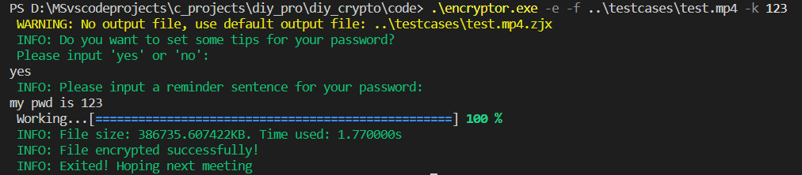
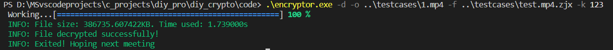
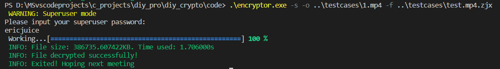
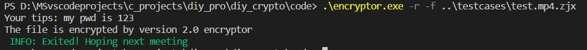

## 加密小工具

### 功能: 
- 对本地文件加解密
- 自定义密码
- 支持密码提示
- 支持自定义超级密码superkey(即后门, 可以直接解密)

### 版本更新
- 2023-09-21 v1.0. 支持基础的加解密/自定义密码/密码提示/超级密码.
- 2023-10-05 v2.0. 支持显示进度条, IO性能提高20倍, 加入大版本兼容, 优化了一些显示消息.

### 使用方法:
- 加密: <exe_name> -e -f <in_filename> -o <out_filename> -k <your_keyword>
- 解密: <exe_name> -d -f <in_filename> -o <out_filename> -k <your_keyword>
- 后门: <exe_name> -s -f <in_filename>
- 密码提示: <exe_name> -r -f <in_filename>
- 更多使用细节请使用 <exe_name> -h 查看

### 运行截图
测试环境: Windows 10, Powershell, test.mp4(387 MB)

加密模式:


解密模式:


超级密码模式:


密码提示恢复:


### 实现流程

#### 加密
输入口令 keyword
通过 `crypto::keyGen(std::string keyword)` 生成密钥 S
询问是否生成提示信息
将信息写入一个文件头A (后面介绍)
将 S 和文件异或加密, 详见 `crypto::encryptFile()`
将文件头A和加密后的文件一起存放, 加密完成

#### 解密
先输入口令t并读取文件头, 验证是否匹配版本和密钥
通过 `keyGen(superkey) ^ key_in_head == keyGen(t)`, 详见 `crypto::decryptFile()`
成功验证之后解密

#### 文件头
加密文件中有512 bits (64 bytes)的文件头, 结构在`help.h`中定义如下
```cpp
struct file_header{ // 512 bytes
    char author[8]; // max 8 bytes , note: the last char must be '\0'
    int version1; // 4 bytes, to check if the file is right version
    int version2; // 4 bytes
    unsigned int key[KEY_LEN_BYTES / 4]; // key = keygen(t) ^ kegen(superkey)
    char tips[512 - 8 - 8 - KEY_LEN_BYTES]; // tips for recover key
};
```

#### 超级密码
超级密码写死在程序里, 可以通过 `keygen(superkey)` 来辅助加密, 以提升加密强度
超级用户密码验证完成之后, 解密流程同上, 详见 `crypto::superuser()`

#### 密码提示
明文存在文件头A中, 直接读取即可, 详见 `crypto::printTips(std::string infilename)`

#### 动态性能加速
根据文件大小设置不同的加密块大小, 以实现动态的运行速度, 详见 `crypto::keyXorFile()`

### todo
加入md5完整性校验
图形化
